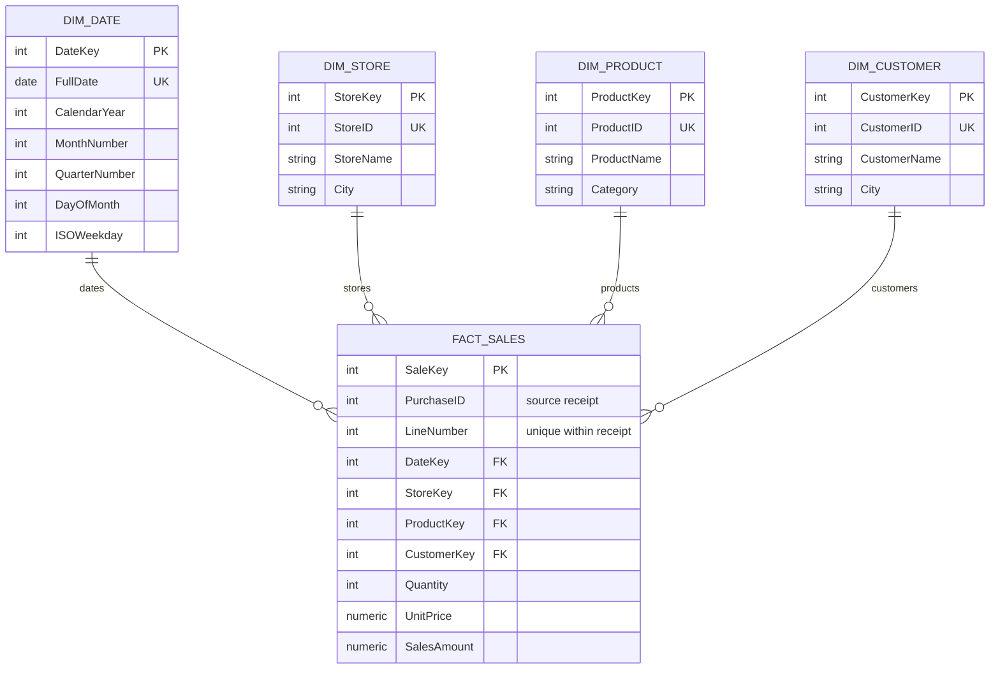

# Star schema reference solution

Try the worksheet and query tasks in the [practice instructions](../README.md)
first. Use this guide to compare your model, query answers, and explanations with
the reference solution.

## Model decisions

The process is completed retail sales. The grain is **one line item in a
completed purchase**. `PurchaseID` identifies a receipt, and `(PurchaseID,
LineNumber)` is unique in this single-source dataset. Repeated products on the
same receipt remain separate lines.

`SaleKey` identifies the warehouse fact row; it cannot by itself prevent a second
load of the same source line. The unique source-line constraint serves that
purpose. `PurchaseID` is a degenerate dimension: useful context retained in the
fact table without a separate `DimPurchase`.

Customer, product, and store keys are generated warehouse identifiers. Their
source IDs remain available for loading and business identification. The date
key is the calendar exception, encoded as `YYYYMMDD`. An unknown customer gets a
real dimension row, so its purchases survive dimension joins.



Each dimension member can be referenced by many sales lines. Every sales line
references exactly one row in each dimension. Measures and dimension attributes
must describe that same line event.

The three starter replacements are:

| Placeholder | Replacement |
| --- | --- |
| `__CUSTOMER_DIMENSION_REFERENCE__` | `DimCustomer(CustomerKey)` |
| `__PURCHASE_LINE_COLUMNS__` | `PurchaseID, LineNumber` |
| `__LINE_AMOUNT_RULE__` | `SalesAmount = Quantity * UnitPrice` |

## Script order

Use the [environment instructions](../README.md#environment-preparation) to
prepare your own workspace and start the services. For a complete reference run,
save the following files in that workspace. The reference filenames keep your
own schema and query answers intact.

| Supplied file | Save in your workspace as |
| --- | --- |
| [Completed schema](01_create_tables.sql) | `sql/01_create_tables_reference.sql` |
| [Data loader](../starter/02_load_data.sql) | `sql/02_load_data.sql` |
| [Reference queries](03_analysis.sql) | `sql/03_analysis_reference.sql` |
| [Data checks](../starter/04_validate.sql) | `sql/04_validate.sql` |

Reuse the loader and checks if you already copied them during the practice.
Run these commands from your workspace's folder containing `compose.yml`:

```bash
docker compose exec db psql -v ON_ERROR_STOP=1 -f /sql/01_create_tables_reference.sql
docker compose exec db psql -v ON_ERROR_STOP=1 -f /sql/02_load_data.sql
docker compose exec db psql -v ON_ERROR_STOP=1 -f /sql/03_analysis_reference.sql
docker compose exec db psql -v ON_ERROR_STOP=1 -f /sql/04_validate.sql
```

`-v ON_ERROR_STOP=1` stops a script at the first SQL error; fix it before running
the next file. `-f` selects the file inside the container. See the
[command explanation](../README.md#run-the-sql-files) for details.

The schema script recreates `star`, deleting its previous tables and data. The
loader replaces the five tables' contents and translates source IDs to dimension
keys; it is a reproducible fixture, not an incremental production loader. The
query file only reads data. Validation creates temporary checks and fails if the
fixture does not match the expectations.

## Expected results

Baseline: **15 fact rows, 7 purchases, 43 units, EUR 56.90 revenue**. Dimensions:
61 dates, 2 stores, 4 products, and 4 customer records including the unknown
shopper. These are reference outputs for this fixture, not universal invariants.

### A. Revenue by store and month

| Year | Month | Store | Revenue (EUR) |
| --- | --- | --- | ---: |
| 2026 | 9 | Tallinn Central | 13.00 |
| 2026 | 9 | Tartu Centre | 7.40 |
| 2026 | 10 | Tallinn Central | 18.50 |
| 2026 | 10 | Tartu Centre | 18.00 |

The daily drill-down produces:

| Date | Tallinn Central (EUR) | Tartu Centre (EUR) |
| --- | ---: | ---: |
| 2026-09-30 | 13.00 | 7.40 |
| 2026-10-01 | 12.00 | 12.50 |
| 2026-10-02 | 6.50 | 5.50 |

The reference SQL returns one row per store/date rather than this display's
pivoted columns. Daily values sum to their monthly values. Changing `GROUP BY`
changes the report grain; it does not change what a fact row means.

### B. Categories and leading products

| Category | Revenue (EUR) |
| --- | ---: |
| Fruit | 27.40 |
| Dairy | 15.00 |
| Bakery | 14.50 |

The three highest-revenue products are Apple (22.50), Milk (15.00), and Bread
(14.50). Banana contributes the remaining 4.90. Category is already a descriptive
attribute in `DimProduct`; no separate category join is needed here.

### C. Basket size

| Purchase | Units |
| --- | ---: |
| 1001 | 3 |
| 1002 | 7 |
| 1003 | 5 |
| 1004 | 11 |
| 1005 | 7 |
| 1006 | 4 |
| 1007 | 6 |

Average basket size is **43 / 7 = 6.1429 units**. There is one intermediate row
per purchase before averaging. For distinct products per basket, that intermediate
query would use `COUNT(DISTINCT ProductKey)` instead of `SUM(Quantity)`.

The deliberately misleading query groups customer/day and averages line quantities.
Alice's four lines on September 30 average 2.5 units per line; her two purchases
average 5 units per basket. Even summing customer/day would combine two baskets
into one group.

### D. Average price paid per unit

| Product | Units | Revenue (EUR) | Revenue / units | Unweighted line-price average |
| --- | ---: | ---: | ---: | ---: |
| Apple | 20 | 22.50 | 1.1250 | 1.2400 |
| Banana | 6 | 4.90 | 0.8167 | 0.8500 |
| Milk | 7 | 15.00 | 2.1429 | 2.1667 |
| Bread | 10 | 14.50 | 1.4500 | 1.5625 |

`AVG(UnitPrice)` gives each line equal weight. Revenue divided by units weights
prices by the number of units sold. Sum the additive components before forming
the ratio, and round only for display. The reference query uses `NULLIF` to avoid
division by zero when adapted to a dataset with empty or zero-unit groups.

## Validation and limits

[04_validate.sql](../starter/04_validate.sql) checks fixture totals, uniqueness,
dimension matches, purchase-level consistency, monthly reconciliation, unknown
customer retention, and representative basket and price results. In particular,
the unknown shopper contributes three lines and EUR 5.50; losing those lines
would understate revenue.

The DDL enforces line uniqueness, non-null foreign keys, positive quantities,
nonnegative prices, and the simplified amount calculation. The validation also
checks a business rule the DDL does not enforce across rows: every receipt has
one date, store, and customer.

Customer attributes are static here. Overwriting a city would change historical
reports grouped by that attribute. Use the separate [SCD extension](../optional/scd2/README.md)
to explore preserving history; it does not alter this core model.
